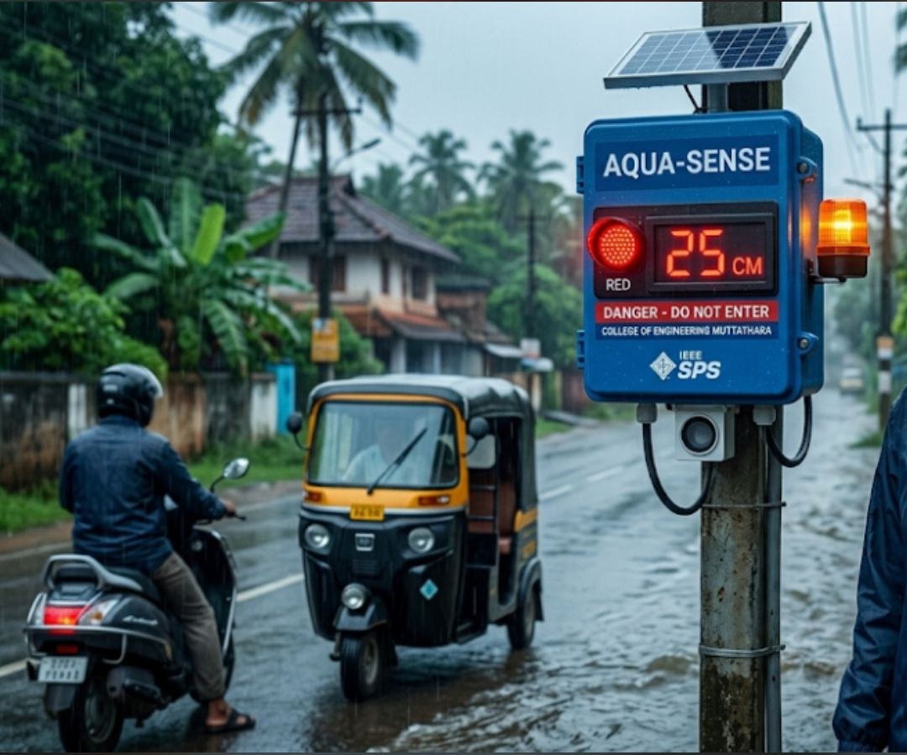

## AQUA-SENSE
-----------------------------------

This is just a project idea which i choosed recemtly as part of a competition.So as other repositories of my profile,this is not like that.
During peak monsoons in Kerala, localized flash flooding on minor streets creates a severe hazard for daily commuters. While major rivers are actively monitored, our municipal roads completely lack telemetry—leaving two-wheelers and auto-rickshaws to blindly face catastrophic engine hydro-locking and injury. 
I designed AQUA-SENSE to eliminate this infrastructural blind spot. By combining high-frequency ultrasonic signal processing with real-time IoT tracking, the edge node dynamically filters out intense monsoon rain noise to deliver highly accurate, street-level flood depth data. This translates into instant, color-coded physical road alerts and live digital telemetry for municipal mapping.
As a Computer Science Engineering student, seeing a project built with extreme cost-efficiency (a prototype under ₹500!) get recognized on such a prestigious technical platform is incredibly validating.

This is the preview of the idea i have

